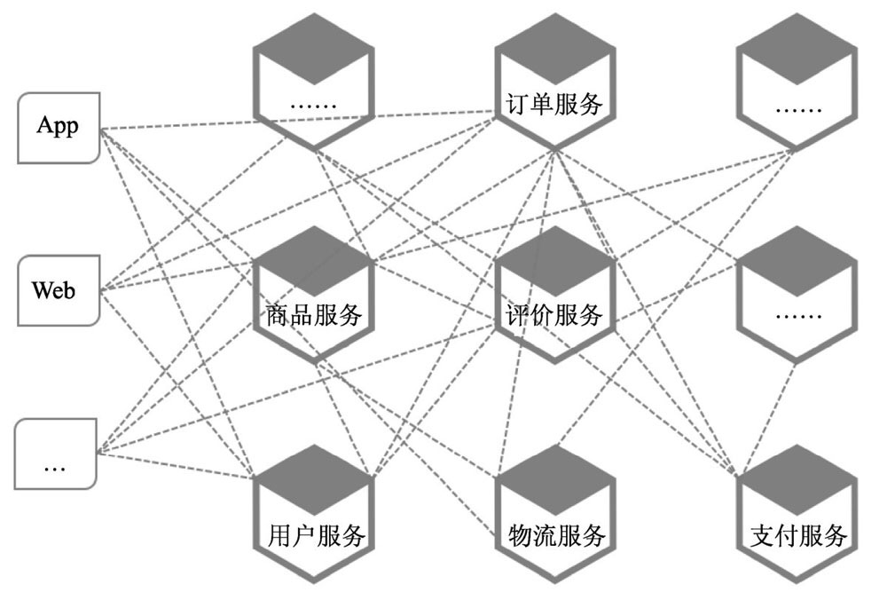
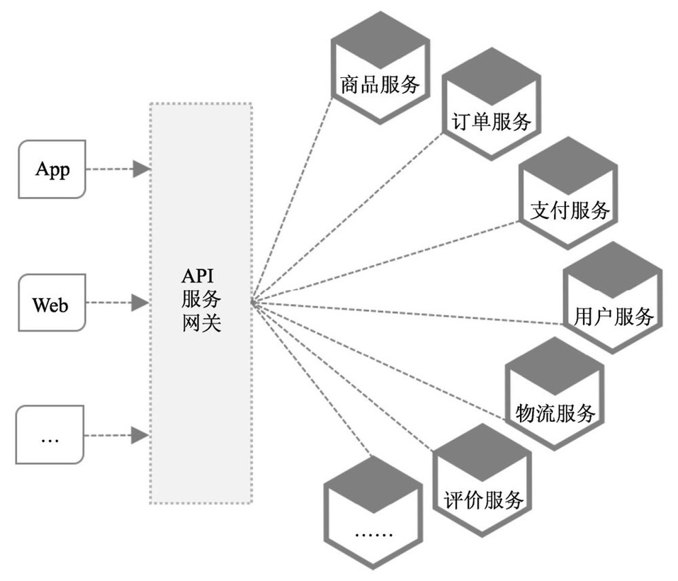
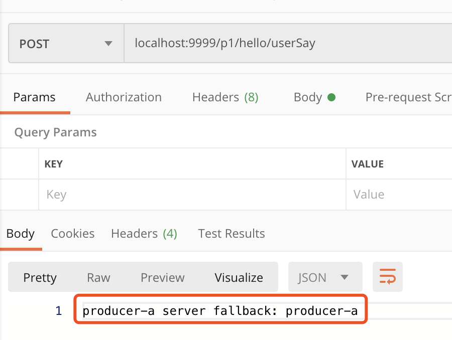

## Zuul网关

在微服务大势所趋的时候，每个服务互相调用后才能获取我们客户端想要的结果，如果让客户端一一去调用每个微服务是不现实的，而且会加重了客户端的负担，后期的维护也会有巨大的成本。下面我们就简单聊聊微服务中的网关这个组件处于什么地位，能给我们带来什么优势，微服务网关是如何搭建的，网关中间的容错机制是怎么实现和处理的。

#### 一、zuul网关组件

先看下没有网关的微服务集群客户端和服务端请求是如何调用的。



由于微服务通常是提供API的细粒度，然而客户端则需要众多这样的API才能完成一个功能的请求处理，这样就迫使客户端和多个微服务服务端进行频繁的交互。

另外客户端的多样性，众多的微服务服务端要同时兼容不同的客户端样式。随着业务的演进，微服务的划分也会随时发生变化，如果不能对客户端隐藏这些细节的变化，那么如果微服务服务端一旦发生变化，那么就会牵一发而动全身的尴尬境地。

同时，对于微服务调用也需要对客户端的身份验证，业务鉴权，流量和并发控制及响应数据的脱敏等控制，这些都急需我们要一个统一的入口来控制。

此时，就是好好思考架构的时机到了。

下面我们看下更有优势的架构设计。



API服务网关就应运而生，网关出现在微服务边界上的一个面向API的，串行集中式的，对访问请求强管控制的服务，采用的是外观模式，负责服务请求路由，组合及协议转换等处理。

简单总结网关的优势：

1. 网关服务帮助开发者隐藏系统架构实现的细节，提供统一入口。
2. 由于统一访问控制，简化了客户端的复杂度，降低与微服务之间通信次数。
3. 借助网关服务做切面任务。
4. 通过网关对异构系统统一整合。
5. 网关服务实现一个高可用弹性服务，避免单点失效。


#### 二、搭建网关服务

简单了解了上面说的网关服务的地位和优势，接下来，我们在我们的项目中如何快速搭建一个网关服务呢？

我们需要依赖zuul组件

```xml
<dependency>
    <groupId>org.springframework.cloud</groupId>
    <artifactId>spring-cloud-starter-netflix-zuul</artifactId>
</dependency>
```

zuul组件整合了熔断器，所以在后面的熔断服务可以更简单的操作执行，我们需要在启动类上加上启动zuul的组件。

```java
/**
 * @Auther: Darryl
 * @Description: gateway boot application
 * @Date: 2020/04/21
 */
@SpringBootApplication
@EnableZuulProxy
public class GatewayBootApplication {
   public static void main(String[] args) {
      SpringApplication.run(GatewayBootApplication.class, args);
   }
}
```

那么配置文件如下：

```yaml
# application port
server:
  port: 9999
# eureka properties
eureka:
  instance:
    prefer-ip-address: true
    ip-address: 127.0.0.1
  client:
    register-with-eureka: true
    fetch-registry: true
    service-url:
      defaultZone: http://${eureka.instance.ip-address}:7777/eureka
# application name
spring:
  application:
    name: gateway-zuul
# actuator exposure endpoints
management:
  endpoints:
    web:
      exposure:
        include: "*" #注意这里*要加引号，暴露全部，也可以只暴露相应endpoint
# route info
zuul:
  ignored-services: '*'
  routes:
    # route name
    producer-a: /p1/**
```

完成上面的操作，我们就可以快速简单的搭建一个网关微服务了。这样，我们可以通过网关服务去调用微服务集群中的任意一个服务实例。

详细代码可以参考我的GitHub：https://github.com/bboysun/springcloud  记得留下小小的star。


#### 三、网关容错机制

前面我们提到过，zuul组件集成了hystrix组件，所以可以很快捷的做相关的容错机制，我们可以通过实现`FallbackProvider`这个接口，来完成服务请求的容错机制。

我们简单看下这个接口的抽象方法；

`String getRoute()`用户获取路由名称，注意这里是获取路由名而不是服务ID。

`ClientHttpResponse fallbackResponse(String route, Throwable cause)`容错机制返回的响应请求。

接下来，我们看一个简单的zuul容错的实现方法；

```java
/**
 * @Auther: Darryl
 * @Description: 服务提供者的服务，提供的回退功能
 * @Date: 2020/04/22
 */
@Component
public class ProducerAppFallBack implements FallbackProvider {
   private Logger log = LoggerFactory.getLogger(this.getClass());

   // 这里返回的route名称，而不是服务名称
   @Override
   public String getRoute() {
      return "producer-a";
   }

   @Override
   public ClientHttpResponse fallbackResponse(String route, Throwable cause) {
      // 返回一个http response
      return new ClientHttpResponse() {
         // 返回一个状态码相关信息
         @Override
         public HttpStatus getStatusCode() throws IOException {
            return HttpStatus.BAD_REQUEST;
         }
         @Override
         public int getRawStatusCode() throws IOException {
            return HttpStatus.BAD_REQUEST.value();
         }
         @Override
         public String getStatusText() throws IOException {
            return HttpStatus.BAD_REQUEST.getReasonPhrase();
         }
         @Override
         public void close() {

         }
         // 返回response body
         @Override
         public InputStream getBody() throws IOException {
            log.info("zuul gateway降级处理");
            return new ByteArrayInputStream(("producer-a server fallback: " + ProducerAppFallBack.this.getRoute()).getBytes());
         }
         // 返回headers
         @Override
         public HttpHeaders getHeaders() {
            HttpHeaders headers = new HttpHeaders();
            headers.setContentType(MediaType.APPLICATION_JSON);
            return headers;
         }
      };
   }
}
```

那么我们看下如果服务提供者服务实例没有启动，我们直接调用网关后返回的结果是怎样的呢？



至此，我们简单了解了什么是网关API，如何快速构建一个网关服务，怎样简单实现网关的容错机制。

后续，我们继续了解zuul网关的路由规则，过滤器，`@EnableZuulServer`和`@EnableZuulProxy`的区别等等。