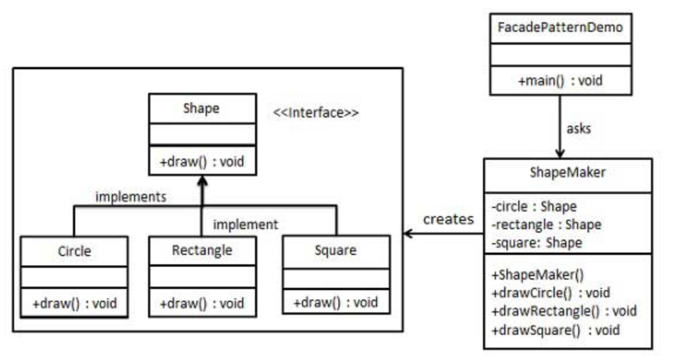

## 外观模式

简单了解外观模式，对于客户端隐藏了系统的复杂性，并向客户端提供一个访问统一入口，类比我们学习的Spring cloud微服务组件中，有点类似zuul网关的作用，为客户端提供一个统一的网关入口，对客户端隐藏了微服务之间的相互调用的复杂性，当我们微服务需要扩展时，不至于客户端也跟着一起响应的变动。

这种模式涉及到一个单一的类，该类提供了客户端请求的简化方法和对现有系统类方法的委托调用。

说到这里，我们就想到了代理模式，装饰模式，他们三个之间有什么区别呢，至少看起来这三个设计模式是很像的。

代理模式我理解的，是我们需要一个类去代理另一个类去执行相关的方法，代理类可以在被代理类方法执行前后做响应的额外操作，想想Spring AOP是如何实现的，使用了动态代理，动态代理生成了一个匿名类，这个代理匿名类可以在切点前后做一些操作。想想JDK自带的动态代理，代理类和被代理类实现同一个接口，去做相关的业务操作。（代码可以参考：https://github.com/bboysun/design-pattern）

装饰模式我理解的，装饰模式是为了扩展一个类的功能，在扩展的过程中，不会对原有类的方法有任何改变的，保证了设计原则中的开闭原则，对新增功能开，对修改功能闭。通过实现一个抽象类实现被装饰类的接口，方便装饰类保证了不丢失被装饰类原有的功能的同时，新增新的功能方法。（代码可以参考：https://github.com/bboysun/design-pattern）

外观模式我理解的，是为了对客户端隐藏服务端的复杂业务调用，给客户端提供一个统一的入口。所以外观模式只是简单的将需要将实现共同一个接口的各个实现类统一封装起来暴露出一个对象类。（代码可以参考：https://github.com/bboysun/design-pattern）

#### 实现

我们将创建一个 *Shape* 接口和实现了 *Shape* 接口的实体类。下一步是定义一个外观类 *ShapeMaker*。

*ShapeMaker* 类使用实体类来代表用户对这些类的调用。*FacadePatternDemo*，我们的演示类使用 *ShapeMaker* 类来显示结果。



#### 关键代码实现

接口类：

```java
/**
 * @Auther: Darryl
 * @Description: animal接口
 * @Date: 2020/04/24
 */
public interface Animal {
   void voice();
}
```

接口的一个实现类：

```java
/**
 * @Auther: Darryl
 * @Description: 猫
 * @Date: 2020/04/24
 */
public class Cat implements Animal {
   @Override
   public void voice() {
      System.out.println("cat voice is miaomiao");
   }
}
```

外观模式类：

```java
/**
 * @Auther: Darryl
 * @Description: 动物叫声的门户模式类（外观模式类）
 * 现有的系统添加一个接口，来隐藏系统的复杂性。
 * 这种模式涉及到一个单一的类，该类提供了客户端请求的简化方法和对现有系统类方法的委托调用。
 *
 * 外观模式 和 代理模式 和 装饰模式 之间的对比思考
 * @Date: 2020/04/24
 */
public class AnimalVoiceMaker {
   private Cat cat;
   private Dog dog;

   public AnimalVoiceMaker(Cat cat, Dog dog){
      this.cat = cat;
      this.dog = dog;
   }

   public void dogVoice() {
      dog.voice();
   }

   public void catVoice() {
      cat.voice();
   }
}
```

具体相关代码可以参考我的GitHub：https://github.com/bboysun/design-pattern 中找对应的设计模式的具体实现代码。

