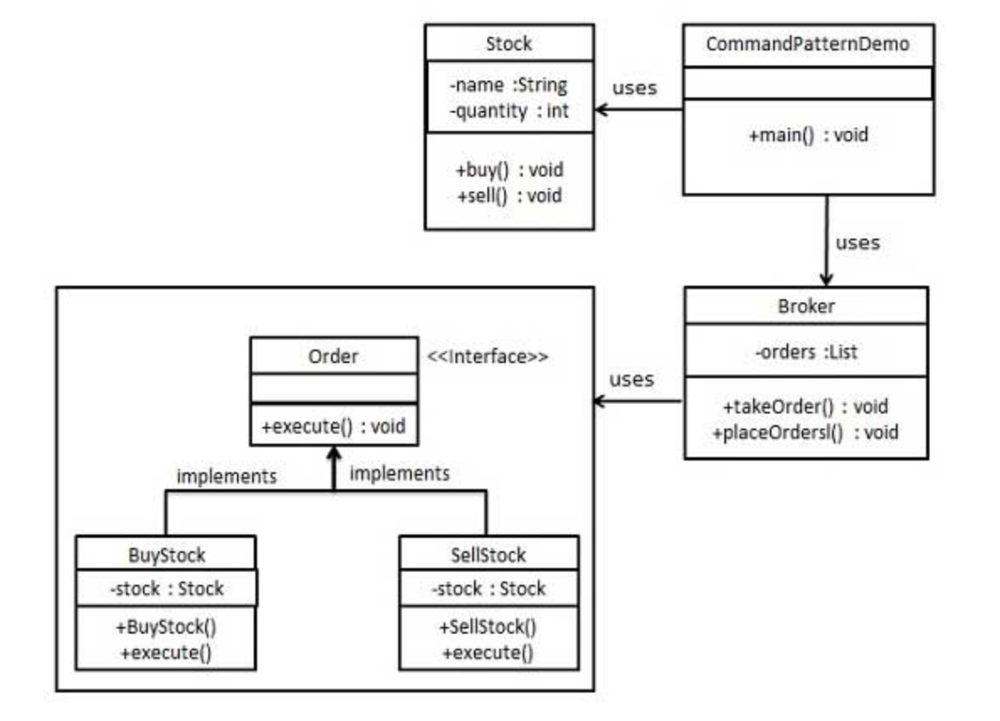

## 命令模式

#### 一、简介

命令模式（command pattern）是一种数据驱动的模式，属于行为模式。请求以命令的形式包裹在对象中，并传到调用对象。

通过构建一个命令的接口，可以实现不同命令的具体的实现类。在命令的具体实现类的构造函数中传入命令可以处理的事件对象。然后，我们再构建一个命令调用器，统一的添加命令，统一的处理命令，完成每个命令的独立解耦实现。

接下来我们根据不同的维度认识命令模式：

**意图**：将一个请求封装成一个对象，从而可以使用不同的请求对象。

**解决**：行为请求者与行为实现者通常是一种紧耦合的关系，但在某些场合，比如需要对行为进行记录，撤销或者重做，事务等处理时，通过命令模式可以灵活的抵御这种变化。

**如何解决：**通过调用者调用接受者执行命令，顺序：调用者→接受者→命令。

**关键代码：**定义三个角色：1、received 真正的命令执行对象 2、Command 3、invoker 使用命令对象的入口。

**优点：** 1、降低了系统耦合度。 2、新的命令可以很容易添加到系统中去。

**缺点：**使用命令模式可能会导致某些系统有过多的具体命令类。

#### 二、实现

我们首先创建作为命令的接口 *Order*，

然后创建作为请求的 *Stock* 类。

实体命令类 *BuyStock* 和 *SellStock*，实现了 *Order* 接口，将执行实际的命令处理。

创建作为调用对象的类 *Broker*，它接受订单并能下订单。

*Broker* 对象使用命令模式，基于命令的类型确定哪个对象执行哪个命令。

*CommandPatternDemo*，我们的演示类使用 *Broker* 类来演示命令模式。



#### 三、实战

命令接口：

```java
/**
 * @Auther: Darryl
 * @Description: 命令接口
 * @Date: 2020/04/18
 */
public interface Order {
   void execute();
}
```

具体命令的实现类

```java
/**
 * @Auther: Darryl
 * @Description: 具体买的命令
 * @Date: 2020/04/18
 */
public class BuyOrder implements Order {
   private Stock stock;

   public BuyOrder(Stock stock) {
      this.stock = stock;
   }

   @Override
   public void execute() {
      stock.buy();
   }
}
```

```java
/**
 * @Auther: Darryl
 * @Description: 具体卖出的命令
 * @Date: 2020/04/18
 */
public class SellOrder implements Order {
   private Stock stock;

   public SellOrder(Stock stock) {
      this.stock = stock;
   }

   @Override
   public void execute() {
      stock.sell();
   }
}
```

具体事件类：

```java
/**
 * @Auther: Darryl
 * @Description: 一个股票的请求类
 * @Date: 2020/04/18
 */
public class Stock {
   private String name;
   private int quantity;

   public Stock(String name, int quantity) {
      this.name = name;
      this.quantity = quantity;
   }

   public void buy() {
      System.out.println("buy [" + quantity + "] stock name is [" + name + "]");
   }

   public void sell() {
      System.out.println("sell [" + quantity + "] stock name is [" + name + "]");
   }
}
```

接下来，需要一个统一命令的调用器：

```java
/**
 * @Auther: Darryl
 * @Description: 命令的统一的调用器
 * @Date: 2020/04/18
 */
public class Broker {
   private List<Order> orderList = Lists.newArrayList();

   public void takeOrder(Order order) {
      orderList.add(order);
   }

   public void placeOrder() {
      orderList.forEach(order -> {
         order.execute();
      });
      orderList.clear();
   }
}
```

最后，我们看下一个demo实现：

```java
/**
 * @Auther: Darryl
 * @Description: 命令模式Demo类入口
 * @Date: 2020/04/18
 */
public class CommandDemo {

   public static void main(String[] args) {
      Broker broker = new Broker();

      broker.takeOrder(new BuyOrder(new Stock("TTT",2000)));
      broker.takeOrder(new SellOrder(new Stock("TTT",100)));

      broker.placeOrder();
   }

}
```

详细代码也可以参考我的GitHub：https://github.com/bboysun/design-pattern

记得给个五星好评哈:star:

