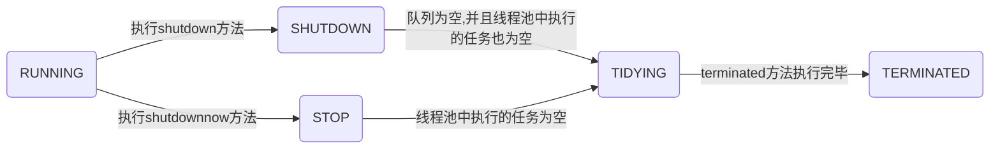

## ==线程池的那些事儿==

#### 一、前言

多线程开发过程中，在阿里手册里面指出一条规则：【强制】线程资源必须通过线程池提供，不允许在应用中自行显式创建线程。使用线程池的好处是减少在创建和销毁线程上所花的时间以及系统资源的开销，解决资源不足的问题。如果不使用线程池，有可能造成系统创建大量同类线程而导致消耗内存或者过度切换的问题。

所以说，

1. 线程是稀缺资源，创建的太多会造成内存溢出（OOM），因为创建一个线程会默认的给这个线程分配1M的堆栈内存，这个堆栈内存是从操作系统中分配获取的。
2. 解耦作用，线程创建和执行完全分开，方便维护。
3. 将线程放到一个池子中去，可以给其他任务进行复用。
4. 线程的创建和销毁都会有一定的开销付出。
5. 线程池的参数能够满足很多的业务场景需求。

#### 二、线程池的原理

常见的创建线程池的几种方式：

`ExecutorService executorService = Executors.newCachedThreadPool();` 创建一个无限线程池。

`ExecutorService executorService = Executors.newFixedThreadPool(nThread);` 创建一个固定大小的线程池。

`ExecutorService executorService = Executors.newSingleThreadExecutor();` 创建单个线程的线程池。

随便看个源码：

```java
/**
 * Creates a thread pool that reuses a fixed number of threads
 * operating off a shared unbounded queue, using the provided
 * ThreadFactory to create new threads when needed.  At any point,
 * at most {@code nThreads} threads will be active processing
 * tasks.  If additional tasks are submitted when all threads are
 * active, they will wait in the queue until a thread is
 * available.  If any thread terminates due to a failure during
 * execution prior to shutdown, a new one will take its place if
 * needed to execute subsequent tasks.  The threads in the pool will
 * exist until it is explicitly {@link ExecutorService#shutdown
 * shutdown}.
 *
 * @param nThreads the number of threads in the pool
 * @param threadFactory the factory to use when creating new threads
 * @return the newly created thread pool
 * @throws NullPointerException if threadFactory is null
 * @throws IllegalArgumentException if {@code nThreads <= 0}
 */
public static ExecutorService newFixedThreadPool(int nThreads, ThreadFactory threadFactory) {
    return new ThreadPoolExecutor(nThreads, nThreads,
                                  0L, TimeUnit.MILLISECONDS,
                                  new LinkedBlockingQueue<Runnable>(),
                                  threadFactory);
}

/**
 * Creates an Executor that uses a single worker thread operating
 * off an unbounded queue. (Note however that if this single
 * thread terminates due to a failure during execution prior to
 * shutdown, a new one will take its place if needed to execute
 * subsequent tasks.)  Tasks are guaranteed to execute
 * sequentially, and no more than one task will be active at any
 * given time. Unlike the otherwise equivalent
 * {@code newFixedThreadPool(1)} the returned executor is
 * guaranteed not to be reconfigurable to use additional threads.
 *
 * @return the newly created single-threaded Executor
 */
public static ExecutorService newSingleThreadExecutor() {
    return new FinalizableDelegatedExecutorService
        (new ThreadPoolExecutor(1, 1,
                                0L, TimeUnit.MILLISECONDS,
                                new LinkedBlockingQueue<Runnable>()));
}
```

实际上都是利用了 `ThreadPoolExecutor` 类实现的。So，重点看下这个类是怎么玩的。看下它的API如下：

```java
    /**
     * Creates a new {@code ThreadPoolExecutor} with the given initial
     * parameters.
     *
     * @param corePoolSize the number of threads to keep in the pool, even
     *        if they are idle, unless {@code allowCoreThreadTimeOut} is set
     * @param maximumPoolSize the maximum number of threads to allow in the
     *        pool
     * @param keepAliveTime when the number of threads is greater than
     *        the core, this is the maximum time that excess idle threads
     *        will wait for new tasks before terminating.
     * @param unit the time unit for the {@code keepAliveTime} argument
     * @param workQueue the queue to use for holding tasks before they are
     *        executed.  This queue will hold only the {@code Runnable}
     *        tasks submitted by the {@code execute} method.
     * @param threadFactory the factory to use when the executor
     *        creates a new thread
     * @param handler the handler to use when execution is blocked
     *        because the thread bounds and queue capacities are reached
     * @throws IllegalArgumentException if one of the following holds:<br>
     *         {@code corePoolSize < 0}<br>
     *         {@code keepAliveTime < 0}<br>
     *         {@code maximumPoolSize <= 0}<br>
     *         {@code maximumPoolSize < corePoolSize}
     * @throws NullPointerException if {@code workQueue}
     *         or {@code threadFactory} or {@code handler} is null
     */
    public ThreadPoolExecutor(int corePoolSize,
                              int maximumPoolSize,
                              long keepAliveTime,
                              TimeUnit unit,
                              BlockingQueue<Runnable> workQueue,
                              ThreadFactory threadFactory,
                              RejectedExecutionHandler handler) {
        if (corePoolSize < 0 ||
            maximumPoolSize <= 0 ||
            maximumPoolSize < corePoolSize ||
            keepAliveTime < 0)
            throw new IllegalArgumentException();
        if (workQueue == null || threadFactory == null || handler == null)
            throw new NullPointerException();
        this.acc = System.getSecurityManager() == null ?
                null :
                AccessController.getContext();
        this.corePoolSize = corePoolSize;
        this.maximumPoolSize = maximumPoolSize;
        this.workQueue = workQueue;
        this.keepAliveTime = unit.toNanos(keepAliveTime);
        this.threadFactory = threadFactory;
        this.handler = handler;
    }
```

**问**：线程池中核心线程数量是100个，新建了一个线程池是怎样初始化的？

**答**：这个线程池初识化，在没有使用的时候是没有线程的，当有需要线程时，才会初始化线程实例，这时初始化出来的线程是不会被销毁，会一直存活在线程池中。

**问**：线程池中的参数有哪些？

**答**：参数介绍如下：

`corePoolSize` 为线程池的基本大小；

`maximumPoolSize` 为线程池最大线程大小；

`keepAliveTime` 和 `unit` 用来控制线程空闲后的存活时间；

`workQueue` 用于存放任务的阻塞队列；

`threadFactory` 当创建一个线程时，用工厂模式去创建一个线程；

`handler` 当队列和最大线程池都满了之后的饱和策略；

Abort策略：默认策略，新任务提交时直接抛出未检查的异常RejectedExecutionException，该异常可由调用者捕获。

CallerRuns策略：为调节机制，既不抛弃任务也不抛出异常，而是将某些任务回退到调用者。不会在线程池的线程中执行新的任务，而是在调用exector的线程中运行新的任务。也就是被调用的线程执行了。

Discard策略：新提交的任务被抛弃。


我们在真正执行的时候，用的是 `executorService.execute(new Job());` 核心就是execute()函数了。

线程池中有一些定义的状态，这些状态和线程的执行密切相关。

```java
    // runState is stored in the high-order bits
    private static final int RUNNING    = -1 << COUNT_BITS;
    private static final int SHUTDOWN   =  0 << COUNT_BITS;
    private static final int STOP       =  1 << COUNT_BITS;
    private static final int TIDYING    =  2 << COUNT_BITS;
    private static final int TERMINATED =  3 << COUNT_BITS;
```

`RUNNING` 是运行状态，指可以接受任务执行队列里的任务。

`SHUTDOWN` 是指调用了 `shutdown()` 方法，不再接受新任务了，但是队列里的任务需要继续执行完毕。

`STOP` 是指调用了 `shutdownnow()` 方法，不再接受新任务，同时抛弃阻塞队列里的所有任务并中断所有正在执行的任务。

`TIDYING` 指所有任务都执行完毕，在调用 `shutdown()` 和 `shutdownnow()` 都会尝试更新为这个状态。

`TERMINATED` 终止状态，当执行 `terminated()` 方法后会更新为这个状态。



了解了各种状态之间的流转过程，然后我们看看`execute()` 方法是如何处理的。

```java
/**
 * Executes the given task sometime in the future.  The task
 * may execute in a new thread or in an existing pooled thread.
 *
 * If the task cannot be submitted for execution, either because this
 * executor has been shutdown or because its capacity has been reached,
 * the task is handled by the current {@code RejectedExecutionHandler}.
 *
 * @param command the task to execute
 * @throws RejectedExecutionException at discretion of
 *         {@code RejectedExecutionHandler}, if the task
 *         cannot be accepted for execution
 * @throws NullPointerException if {@code command} is null
 */
public void execute(Runnable command) {
    if (command == null)
        throw new NullPointerException();
    /*
     * Proceed in 3 steps:
     *
     * 1. If fewer than corePoolSize threads are running, try to
     * start a new thread with the given command as its first
     * task.  The call to addWorker atomically checks runState and
     * workerCount, and so prevents false alarms that would add
     * threads when it shouldn't, by returning false.
     *
     * 2. If a task can be successfully queued, then we still need
     * to double-check whether we should have added a thread
     * (because existing ones died since last checking) or that
     * the pool shut down since entry into this method. So we
     * recheck state and if necessary roll back the enqueuing if
     * stopped, or start a new thread if there are none.
     *
     * 3. If we cannot queue task, then we try to add a new
     * thread.  If it fails, we know we are shut down or saturated
     * and so reject the task.
     */
    int c = ctl.get();                                             //第一步
    if (workerCountOf(c) < corePoolSize) {                         //第二步
        if (addWorker(command, true))
            return;
        c = ctl.get();
    }
    if (isRunning(c) && workQueue.offer(command)) {               //第三步
        int recheck = ctl.get();
        if (! isRunning(recheck) && remove(command))              //第四步
            reject(command);
        else if (workerCountOf(recheck) == 0)                     //第五步
            addWorker(null, false);
    }
    else if (!addWorker(command, false))                          //第六步
        reject(command);
}
```

第一步：获取当前线程池的状态。

第二步：当前线程数量小于`coresize`时，创建一个新的线程运行。

第三步：如果当前线程池处于运行状态，并且写入阻塞队列成功。

第四步：双重检查，再次获取线程池状态；如果线程状态变了（非运行状态）就需要从阻塞队列移除任务，并尝试判断线程是否全部执行完毕。同时执行拒绝策略。

第五步：如果当前线程池为空就新创建一个线程并执行。

第六步：如果在第三步的判断为非运行状态，尝试新建线程，如果失败则执行拒绝策略。


```java
/**
 * Checks if a new worker can be added with respect to current
 * pool state and the given bound (either core or maximum). If so,
 * the worker count is adjusted accordingly, and, if possible, a
 * new worker is created and started, running firstTask as its
 * first task. This method returns false if the pool is stopped or
 * eligible to shut down. It also returns false if the thread
 * factory fails to create a thread when asked.  If the thread
 * creation fails, either due to the thread factory returning
 * null, or due to an exception (typically OutOfMemoryError in
 * Thread.start()), we roll back cleanly.
 *
 * @param firstTask the task the new thread should run first (or
 * null if none). Workers are created with an initial first task
 * (in method execute()) to bypass queuing when there are fewer
 * than corePoolSize threads (in which case we always start one),
 * or when the queue is full (in which case we must bypass queue).
 * Initially idle threads are usually created via
 * prestartCoreThread or to replace other dying workers.
 *
 * @param core if true use corePoolSize as bound, else
 * maximumPoolSize. (A boolean indicator is used here rather than a
 * value to ensure reads of fresh values after checking other pool
 * state).
 * @return true if successful
 */
private boolean addWorker(Runnable firstTask, boolean core) {
    retry:
    for (;;) {
        int c = ctl.get();
        int rs = runStateOf(c);

        // Check if queue empty only if necessary.
        if (rs >= SHUTDOWN &&
            ! (rs == SHUTDOWN &&
               firstTask == null &&
               ! workQueue.isEmpty()))
            return false;

        for (;;) {
            int wc = workerCountOf(c);
            if (wc >= CAPACITY ||
                wc >= (core ? corePoolSize : maximumPoolSize))
                return false;
            if (compareAndIncrementWorkerCount(c))
                break retry;
            c = ctl.get();  // Re-read ctl
            if (runStateOf(c) != rs)
                continue retry;
            // else CAS failed due to workerCount change; retry inner loop
        }
    }

    boolean workerStarted = false;
    boolean workerAdded = false;
    Worker w = null;
    try {
        w = new Worker(firstTask);
        final Thread t = w.thread;
        if (t != null) {
            final ReentrantLock mainLock = this.mainLock;
            mainLock.lock();
            try {
                // Recheck while holding lock.
                // Back out on ThreadFactory failure or if
                // shut down before lock acquired.
                int rs = runStateOf(ctl.get());

                if (rs < SHUTDOWN ||
                    (rs == SHUTDOWN && firstTask == null)) {
                    if (t.isAlive()) // precheck that t is startable
                        throw new IllegalThreadStateException();
                    workers.add(w);
                    int s = workers.size();
                    if (s > largestPoolSize)
                        largestPoolSize = s;
                    workerAdded = true;
                }
            } finally {
                mainLock.unlock();
            }
            if (workerAdded) {
                t.start();
                workerStarted = true;
            }
        }
    } finally {
        if (! workerStarted)
            addWorkerFailed(w);
    }
    return workerStarted;
}
```


#### 三、线程池的配置

需要明白的，线程池肯定不是越大越好，通常我们需要根据这批任务执行的性质来确定，IO密集型任务，由于线程并不是一直在运行，所以可以尽可能的多配置线程，比如CPU个数+2，如果是CPU密集型任务（大量复杂的运算）应当分配较少的线程，比如CPU个数相当的大小。

#### 四、SpringBoot使用线程池

so easy~

