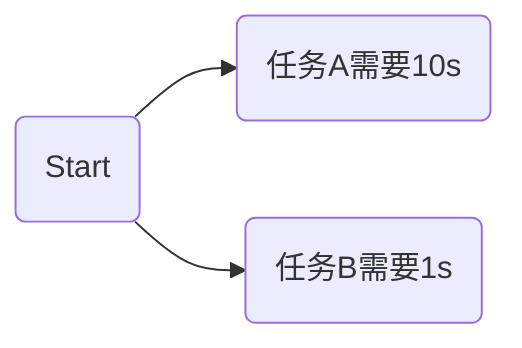

## Java初识多线程

#### 一、进程与线程

首先，我们需要了解进程和线程是怎样的关系。进程我们可以理解在操作系统层面上的一个独立的应用服务，比如我们在win7上打开微信，QQ等，都可以看做是独立的进程。然后看下，百度百科是怎么说进程的。


然后，我们看下线程又是什么。线程可以看成是在进程中独立运行的子任务。比如我们的QQ在运行时，可以有多个子任务同时在执行，如下载文件，视频聊天，传输数据，发送消息等。看下百度百科是怎么说的。


这样我们就大概的了解，进程与线程之间的关系了吧。那么线程有什么优势呢？线程并发的执行保证了CPU利用率的大幅提升。

有两个任务，分别是A，B，串行执行时；只有当任务A执行完成后，才能执行任务B。

```flow
st=>start: Start
op1=>operation: 任务A，需要10s
op2=>operation: 任务B，需要1s
e=>end
st->op1->op2->e
```

并发执行时，任务A和任务B，CPU可以来回切换，任务B不需要等任务A执行完成后才执行，可以更高效的利用CPU。



#### 二、初识Java多线程

Java实现多线程的方式有三种，一种是继承Thread类，一种是实现Runnable接口，一种是实现Callable接口和feature。其中Callable和Runnable的不同之处，Callable提供了call（）方法作为线程的执行体，call（）方法相比Runnable的run（）方法功能更强大。call（）方法有返回值，同时可以声明抛出的异常。

1. 继承Thread类

   ```java
   public class MyThread extends Thread {
   
       @Override
       public void run() {
           try {
               for (int i = 0; i < 10; i++) {
                   int time = (int) Math.random() * 1000;
                   Thread.sleep(time);
                   System.out.println("run=" + Thread.currentThread().getName());
               }
           } catch (InterruptedException e) {
               e.printStackTrace();
           }
       }
   }
   ```

​      

```java
public class Zouni {

    public static void main(String[] args) throws InterruptedException {
        MyThread thread = new MyThread();
        thread.setName("myThread");
        thread.start();
        for (int i=0; i<10; i++) {
            int time = (int) Math.random()*1000;
            Thread.sleep(time);
            System.out.println("main="+Thread.currentThread().getName());
        }
    }
}
```

执行结果如下：


此处，我们需要注意的是，start（）方法是通知"线程规划器"此线程已经准备就绪，等待调用线程对象的run（）方法。这个过程其实是让系统安排一个时间来调用Thread中run（）方法，也就是启动线程，具有异步执行的效果。如果调用代码thread.runa()就不是异步执行了，而是同步执行，那么此线程对象并不交给线程规划器来进行处理，而是由main主线程来调用run（）方法。改为run（）来执行的结果如下：


另外，使用start（）时，线程启动顺序和start（）方法调用顺序无关，完全是并行随机执行的。

2. 实现Runnable接口

   如果欲创建的线程类已经有了一个父类，这时就不能再继承Thread，因为Java不支持多继承，所以需要实现Runnable接口创建线程类。

   同时，我们会发现Thread类其实也是实现Runnable接口的，并且Thread的构造函数中有Thread（Runnable target）和Thread（Runnable target，String name）可以传递Runnable接口，说明构造函数支持传入一个Runnable接口。==同时还可以传入Thread类的对象，这样做完全可以将一个Thread对象中的run（）方法交由其他的线程进行调用==。

   Thread类的构造函数之一如下：

   

​      简单代码示例如下：

```java
public class MyRunnable implements Runnable {

    @Override
    public void run() {
        System.out.println("running...");
    }
}
```

```java
public class Run {

    public static void main(String[] args) {
        MyRunnable runnable = new MyRunnable();
        Thread thread = new Thread(runnable);
        thread.start();
        System.out.println("it is over...");
    }

}
```

运行结果如下：


3. 实现Callable接口，配合Future接口

   提到Callable接口创建线程类，就不得不提前两者的劣势，Thread和Runnable创建的线程类无法获取执行结果。如果想获取执行结果，就必须通过共享变量或者使用线程通信的方式。

   首先，看下Callable接口都有什么东东在里面，如下：

   

   只有一个call（）方法，注意这个方法是有返回值得，和Runnable的run（）的区别就在于此。

   接下来，看下Future接口。Future接口有get（）方法，用于获取结果值，如果当前Future还没有结束，那么当前线程就等待，知道Future运行结束，那么会唤醒等待结果值的线程。cancel（）方法，取消当前的future，会唤醒所有等待结果值的线程。可以看出，Callable代表的是任务，Future代表的是结果值，那么他们是如何搭配使用的呢？

   接着就要看FutureTask类了。这个类的作用就是它的子类可以当做Runnable接口使用，那么创建一个新的线程的时候，就可以使用它的实例作为参数。

   总而言之，Callable表示一个任务，当任务执行完后会返回结果值。结果值并不是立即返回的，需要Future对象，该对象监控Callable任务完成情况，通过组合方式，即Future对象实例一般有个Callable实例的成员变量。当Callable任务还没有完成时，调用Future的get（）方法，就会让当前线程等待，直到Callable任务完成。

   示例代码如下：

   ```java
   public class MyCallable {
   
       /**
        * 创建一个线程
        * @param name 线程名
        * @param future 用于获取线程结果值
        */
       public static void newThread(String name, Future<Integer> future) {
           new Thread(new Runnable() {
               @Override
               public void run() {
                   try {
                       System.out.println("线程"+Thread.currentThread().getName()+"开始运行");
                       int result = future.get();
                       System.out.println("线程"+Thread.currentThread().getName()+"获取结果值："+result);
                   } catch (InterruptedException e) {
                       e.printStackTrace();
                   } catch (ExecutionException e) {
                       e.printStackTrace();
                   }
               }
           }, name).start();
       }
   
   
       public static void main(String[] args) {
           FutureTask<Integer> future = new FutureTask<>(new Callable<Integer>() {
               @Override
               public Integer call() throws Exception {
                   System.out.println("线程"+Thread.currentThread().getName()+"运行任务");
                   Thread.sleep(1000);
                   System.out.println("线程"+Thread.currentThread().getName()+"任务运行完成");
                   return 100;
               }
           });
   
           new Thread(new Runnable() {
               @Override
               public void run() {
                   future.run();
               }
           },"T10").start();
   
           newThread("T1", future);
           newThread("T2", future);
           newThread("T3", future);
           newThread("T4", future);
       }
   }
   ```

   运行结果如下：

   

   到此为止，我们大概的认识了Java的多线程基本知识。

   后续会有更深入的总结分析。

   :notebook:  ==相关代码见D盘 sun 项目中==