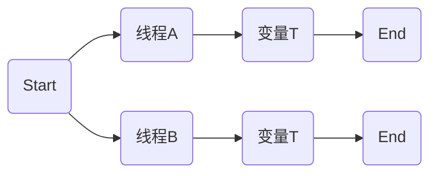
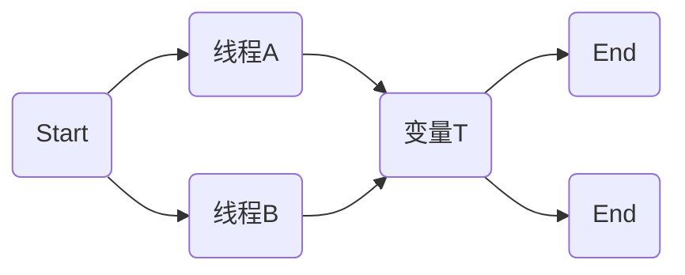

## Java多线程实例变量与线程安全

自定义线程类中的实例变量针对其他线程可以有共享和不共享。这在多线程之间进行交互时是个很重要的技术点。

一、不共享



举个栗子：

```java
public class MyThread extends Thread {

    private int count = 6;

    public MyThread(String name) {
        super();
        this.setName(name);
    }

    @Override
    public void run() {
        super.run();
        while (count > 0) {
            count--;
            System.out.println("由"+this.currentThread().getName()+"计算, count="+count);
        }
    }
}
```

```java
public class Run {

    public static void main(String[] args) {
        MyThread a = new MyThread("A");
        MyThread b = new MyThread("B");
        MyThread c = new MyThread("C");

        b.start();
        a.start();
        c.start();
    }

}
```

运行结果如下：


由此可以看出，我们一共创建了3个线程，每个线程都有各自的count变量。

二、共享



共享数据的情况就是多个线程可以访问同一个变量。

继续举个栗子：

```java
public class MyThread2 extends Thread {
    private int count = 10;

    @Override
    public void run() {
        super.run();
        //此时就不需要用while循环，因为使用同步以后其他线程就得不到运行的机会
        count--;
        System.out.println("由"+this.currentThread().getName()+"计算, count="+count);
    }
}
```

```java
public class Run2 {


    public static void main(String[] args) {

        MyThread2 thread2 = new MyThread2();

        Thread a = new Thread(thread2, "A");
        Thread b = new Thread(thread2, "B");
        Thread c = new Thread(thread2, "C");
        Thread d = new Thread(thread2, "D");
        Thread e = new Thread(thread2, "E");
        Thread f = new Thread(thread2, "F");
        Thread g = new Thread(thread2, "G");
        Thread h = new Thread(thread2, "H");
        Thread i = new Thread(thread2, "I");
        Thread j = new Thread(thread2, "J");

        b.start();
        a.start();
        c.start();
        d.start();
        e.start();
        f.start();
        g.start();
        h.start();
        i.start();
        j.start();

    }
}
```

运行结果如下：


这里面AB两个线程同时打印出了8，说明AB同时对count进行了处理，产生了非线程安全问题。

三、怎样处理非线程安全问题

依然举个栗子，场景是这样的：5个销售员，每个销售员卖出一个货品不可以得出相同的剩余数量，必须在每一个销售员卖完一个货品后其他销售员才可以在新的剩余物品数上减一操作。这时就是需要多个线程之间进行同步，也就是用按顺序排队的方式减一操作。

再看下代码是怎样的。

```java
public class MyThread3 extends Thread {
    private int count = 10;

    @Override
    synchronized public void run() {
        super.run();
        //此时就不需要用while循环，因为使用同步以后其他线程就得不到运行的机会
        count--;
        System.out.println("由"+this.currentThread().getName()+"计算, count="+count);
    }
}
```

```java
public class Run3 {


    public static void main(String[] args) {

        MyThread3 thread = new MyThread3();

        Thread a = new Thread(thread, "A");
        Thread b = new Thread(thread, "B");
        Thread c = new Thread(thread, "C");
        Thread d = new Thread(thread, "D");
        Thread e = new Thread(thread, "E");
        Thread f = new Thread(thread, "F");
        Thread g = new Thread(thread, "G");
        Thread h = new Thread(thread, "H");
        Thread i = new Thread(thread, "I");
        Thread j = new Thread(thread, "J");

        b.start();
        a.start();
        c.start();
        d.start();
        e.start();
        f.start();
        g.start();
        h.start();
        i.start();
        j.start();

    }
}
```

运行结果如下：


synchronized可以在任意对象及方法上加锁，加锁的这段代码称为互斥区或者临界区。非线程安全主要是指多个线程对同一个对象中的同一变量进行操作时会出现值被变更、值不同步的情况，进而影响程序的执行流程。